# Rexense Zigbee Stack SDK — 架构文档

> 本文档描述 SDK 的**生命周期**、**时序逻辑**及**调用关系图谱**。  
> 图表使用 [Mermaid](https://mermaid.js.org/) 语法，可在 GitHub / VS Code 等环境直接渲染。

---

## 目录

1. [SDK 生命周期](#1-sdk-生命周期)
   - [1.1 系统启动（Cold Boot）流程](#11-系统启动cold-boot流程)
   - [1.2 睡眠 / 唤醒（End Device）流程](#12-睡眠--唤醒end-device流程)
   - [1.3 主循环（Main Loop）流程](#13-主循环main-loop流程)
2. [时序逻辑（Sequence Diagrams）](#2-时序逻辑sequence-diagrams)
   - [2.1 入网流程（Network Join）](#21-入网流程network-join)
   - [2.2 消息接收处理流程](#22-消息接收处理流程)
   - [2.3 消息发送流程](#23-消息发送流程)
   - [2.4 OTA 升级流程](#24-ota-升级流程)
3. [调用关系图谱（Module Dependency）](#3-调用关系图谱module-dependency)
   - [3.1 模块总览](#31-模块总览)
   - [3.2 回调函数（Weak Function）关系图](#32-回调函数weak-function关系图)
   - [3.3 插件注册关系图](#33-插件注册关系图)

---

## 1. SDK 生命周期

### 1.1 系统启动（Cold Boot）流程

设备上电后，SDK 按照以下顺序依次调用用户可重写的 **weak callback**，完成硬件初始化、协议栈配置、插件注册及应用入口。

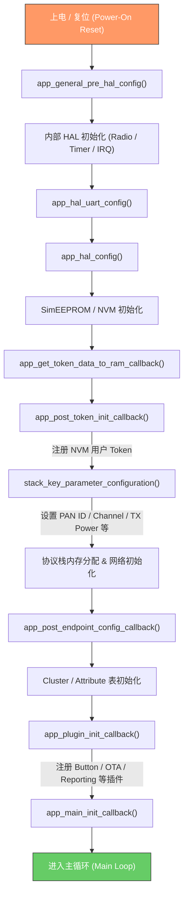

### 1.2 睡眠 / 唤醒（End Device）流程

End Device 支持深度睡眠以节省功耗。唤醒后走简化的初始化路径。

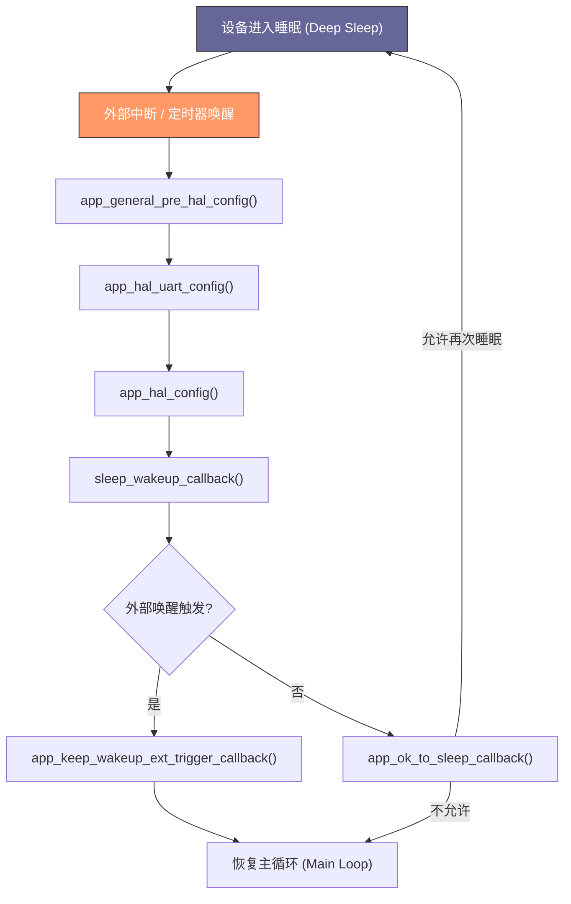

### 1.3 主循环（Main Loop）流程

进入主循环后，SDK 以事件驱动方式周期调用用户 Tick 回调和内部协议栈任务。

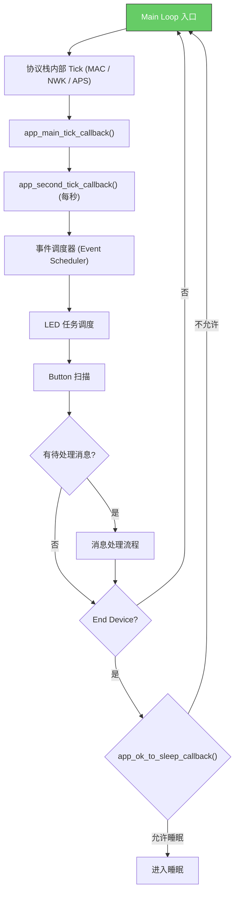

---

## 2. 时序逻辑（Sequence Diagrams）

### 2.1 入网流程（Network Join）

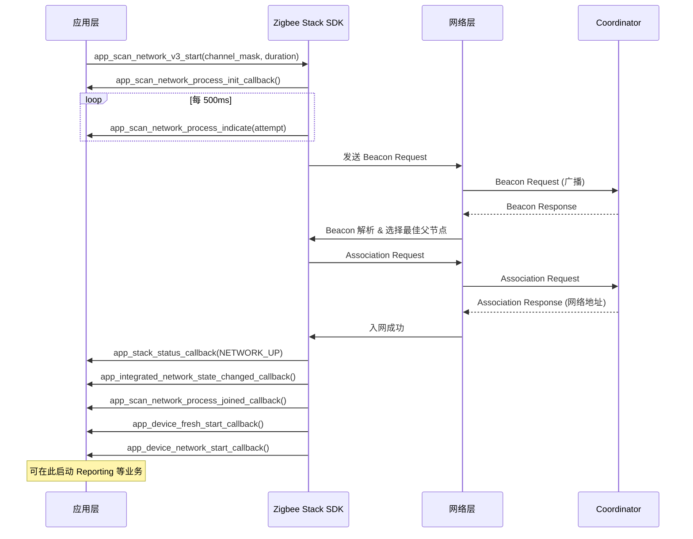

### 2.2 消息接收处理流程

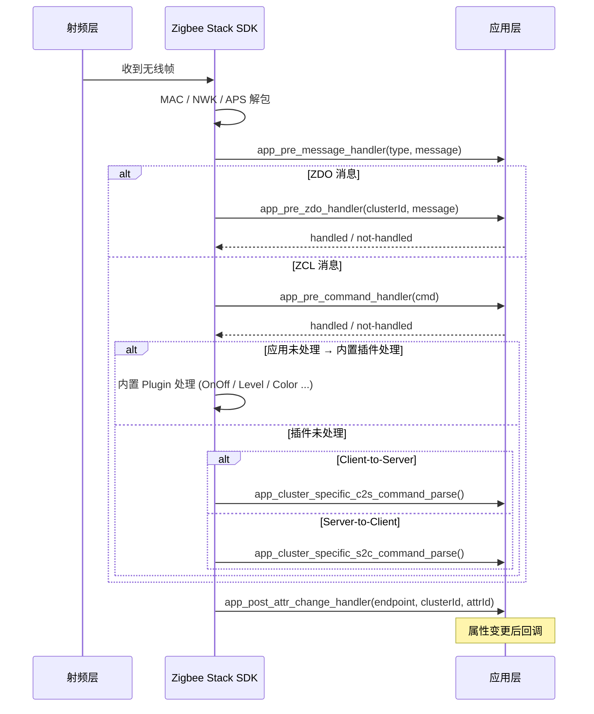

### 2.3 消息发送流程

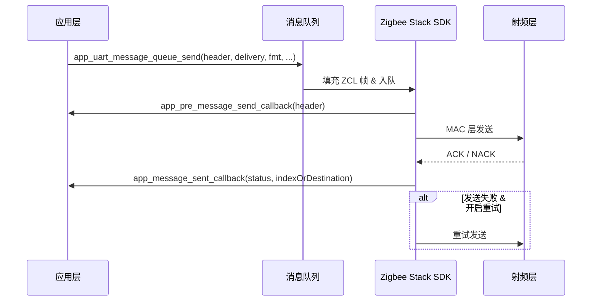

### 2.4 OTA 升级流程

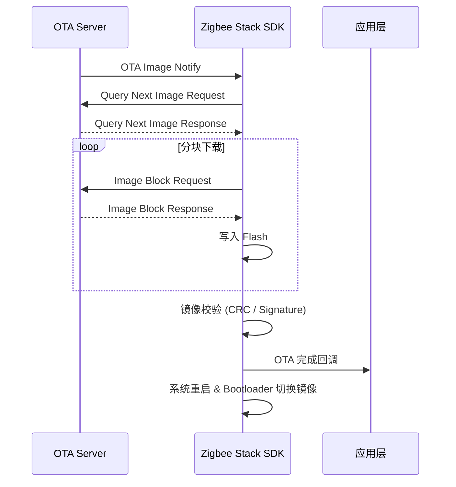

---

## 3. 调用关系图谱（Module Dependency）

### 3.1 模块总览

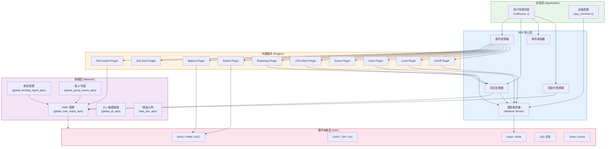

### 3.2 回调函数（Weak Function）关系图

所有用户回调均以 `__attribute__((weak))` 声明于 `weak_function.c`，应用程序按需覆盖。

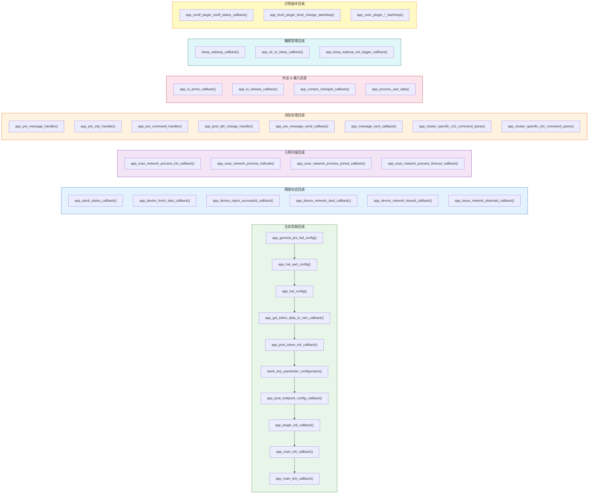

### 3.3 插件注册关系图

插件在 `app_plugin_init_callback()` 中注册，各插件通过属性服务器和消息处理器与协议栈交互。

```mermaid
graph TD
    INIT["app_plugin_init_callback()"]

    INIT --> BTN["app_button_plugin_v2_register()<br/>按键插件"]
    INIT --> OTA["app_ota_client_plugin_register()<br/>OTA 升级插件"]
    INIT --> RPT["app_reporting_plugin_reporting_config_register()<br/>上报插件"]
    INIT --> IAS["app_ias_zone_plugin_register()<br/>IAS Zone 插件"]
    INIT --> BAT["app_battery_monitor_plugin_register()<br/>电池监测插件"]
    INIT --> SCENE["app_scene_plugin_v2_register()<br/>场景插件"]
    INIT --> POLL["app_poll_control_server_plugin_register()<br/>Poll 控制插件"]
    INIT --> MT["app_mass_production_test_register()<br/>量产测试插件"]
    INIT --> LOCK["Door Lock Plugin"]
    INIT --> WC["Window Covering Plugin"]

    BTN --> |"按下/释放回调"| APP_CB["应用回调"]
    OTA --> |"OTA 状态回调"| APP_CB
    RPT --> |"上报结果回调"| APP_CB
    IAS --> |"Zone 状态变更"| APP_CB
    BAT --> |"低电量回调"| APP_CB
    POLL --> |"Poll 结果回调"| APP_CB

    style INIT fill:#e3f2fd,stroke:#1565c0
    style APP_CB fill:#e8f5e9,stroke:#2e7d32
```

---

## 附录：典型应用开发流程

以下展示一个 Router 设备从创建到入网的典型开发步骤：

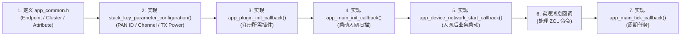

---

## 附录：API 头文件索引

| 头文件 | 功能模块 | 关键 API |
|--------|---------|----------|
| `global_apis.h` | 总入口 | 包含所有子模块头文件 |
| `global_common.h` | 通用定义 | 设备信息、事件注册、调试接口 |
| `global_nwk_mgmt_apis.h` | 网络管理 | `app_scan_network_v3_start()`, `app_leave_network()`, `app_get_network_state()` |
| `global_message_apis.h` | 消息收发 | ZCL/ZDO 消息构造与发送 |
| `global_binding_mgmt_apis.h` | 绑定管理 | 绑定表操作 |
| `global_group_scene_apis.h` | 组 & 场景 | 组管理、场景存储与恢复 |
| `global_button_apis.h` | 按键管理 | 按键事件注册、多击检测 |
| `global_hal_common_apis.h` | 硬件抽象 | GPIO / PWM / ADC / Flash / SPI / I2C |
| `global_lighting_apis.h` | 灯控驱动 | 色温、RGB、PWM 渐变 |
| `global_mem_heap_apis.h` | 动态内存 | Heap malloc / free |
| `global_nvm_apis.h` | NVM 存储 | Token 持久化、NVM3 |
| `global_zll_apis.h` | ZLL 触摸链接 | Initiator / Target 配网 |
| `global_mass_production_test_apis.h` | 量产测试 | 被动/主动测试模式 |
| `fast_join_apis.h` | 快速入网 | Fast Join V3 |
| `global_string_util_apis.h` | 字符串工具 | Hex/ASCII 转换、MD5 |
